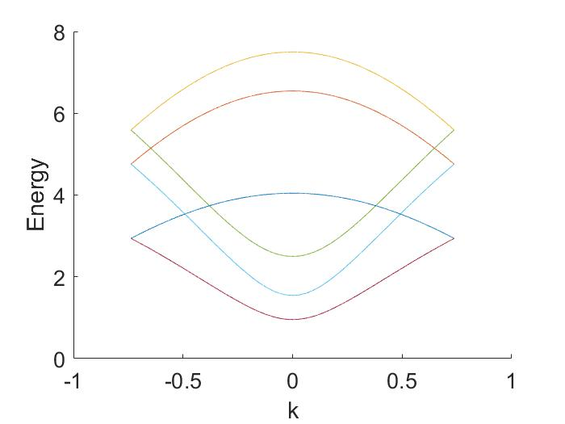
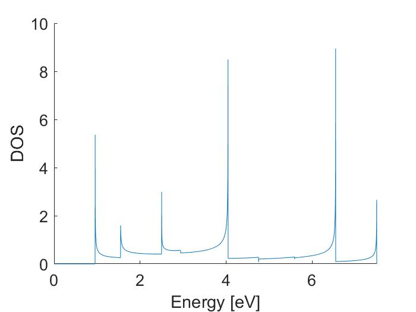
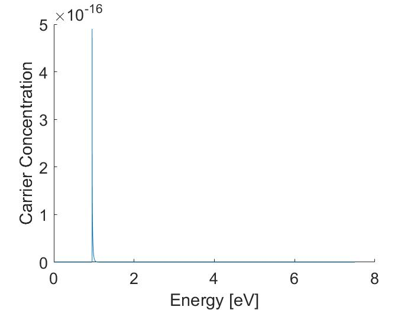

# CNT_TOOLS
This is a matlab repository for numerically creating and outputting the DOS of a CNT of any chirality. It essentially works by inverting the dispersion curves and then making use of matlabs curve fitting tool box to fit each dispersion curve individually. The fits are then used to build the DOS. This makes it then possible to calculate the carrier concentration by using the fermi dirac distribution. 

Here is small demonstration of the capabilities of the provided matlab scripts for a 5,0 CNT:

## Dispersion Curve

## DOS

## Occupied DOS at 300 K 

